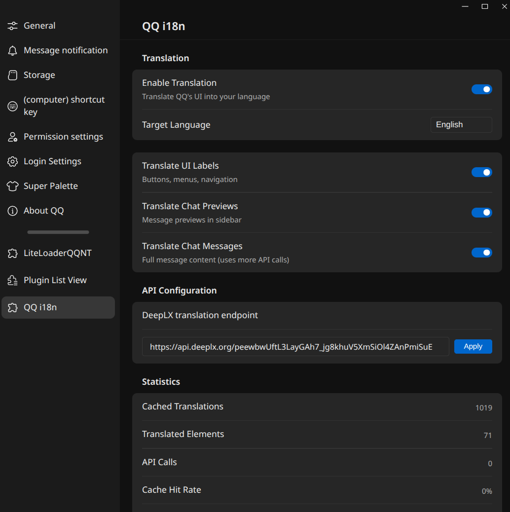

# LiteLoaderQQNT-i18n

English | [简体中文](./README.zh.md)

A [LiteLoaderQQNT](https://github.com/LiteLoaderQQNT/LiteLoaderQQNT) plugin that translates QQ's entire Chinese UI into any language. No API key required.



## Features

- Translates buttons, menus, settings, dropdowns, chat previews, and messages
- Right-click or `Ctrl+Shift+T` any input to translate typed text (toggle between original and translation)
- Toolbar button in chat for quick input translation
- 3-tier cache (memory, static dictionary, IndexedDB) for instant repeated translations
- Hover any translated element to see the original Chinese
- Configurable: toggle UI labels, chat previews, and messages independently
- Works with any [DeepLX](https://github.com/OwO-Network/DeepLX)-compatible API

## Installation

**Plugin List Viewer**: Find "QQ i18n" and click Install, then restart QQ.

**PluginInstaller**: Paste `https://raw.githubusercontent.com/0-don/LiteLoaderQQNT-i18n/main/manifest.json` and restart QQ.

**Manual**: Download the ZIP, go to LiteLoader settings, click "Choose File", select the ZIP, and restart QQ.

## Build

```bash
bun install && bun run build
```

## License

[MIT](./LICENSE)
