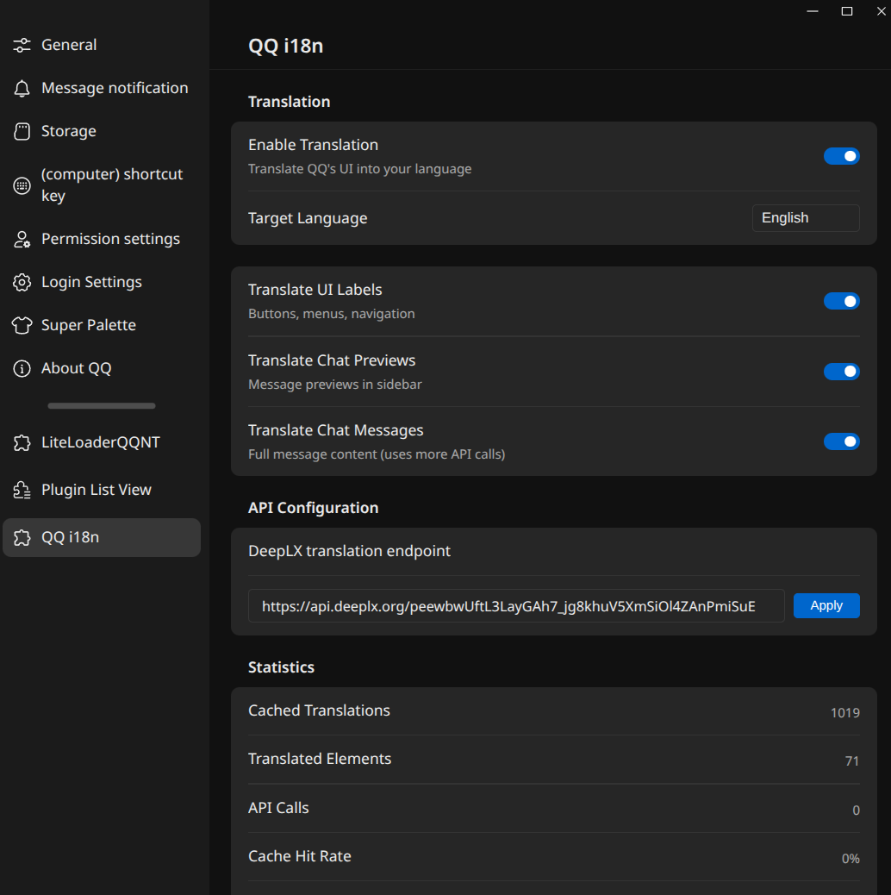

# LiteLoaderQQNT-i18n

English | [简体中文](./README.zh.md)

> Friends: [LINUX DO](https://linux.do/) — 新的理想型社区

A [LiteLoaderQQNT](https://github.com/LiteLoaderQQNT/LiteLoaderQQNT) plugin that translates QQ's entire Chinese UI into any language. No API key required.



> ⚠️ **Account ban risk.** Tencent actively detects modified QQNT clients. Since late 2024, users of LiteLoaderQQNT, NapCat, and similar loaders have reported account restrictions, forced phone/face verification, and permanent bans. PC enforcement is often delayed by several days, so a session that looks fine at the time can still trigger a ban later. Use a secondary/test account, never your primary one. If you just want an ad-free QQ without the risk, use Tencent's official lightweight client [TIM](https://im.qq.com/) instead. See [this thread](https://linux.do/t/topic/485908) for user reports.

## Features

- Translates buttons, menus, settings, dropdowns, chat previews, and messages
- Right-click or `Ctrl+Shift+T` any input to translate typed text (toggle between original and translation)
- Toolbar button in chat for quick input translation
- 3-tier cache (memory, static dictionary, IndexedDB) for instant repeated translations
- Hover any translated element to see the original Chinese
- Configurable: toggle UI labels, chat previews, and messages independently
- Works with any [DeepLX](https://github.com/OwO-Network/DeepLX)-compatible API

## Installation

This is a plugin for [LiteLoaderQQNT](https://github.com/LiteLoaderQQNT/LiteLoaderQQNT), a plugin loader for QQNT (similar to Vencord for Discord). Install LiteLoaderQQNT first, then install this plugin using one of these methods:

- **Plugin List Viewer**: Find "QQ i18n" and click Install, then restart QQ.
- **PluginInstaller**: Paste `https://raw.githubusercontent.com/0-don/LiteLoaderQQNT-i18n/main/manifest.json` and restart QQ.
- **Manual**: Download the ZIP, go to LiteLoader settings, click "Choose File", select the ZIP, and restart QQ.

## Development

Requires [Bun](https://bun.sh).

```bash
bun install
bun run dev        # build + watch for changes
```

If [Chii DevTools](https://github.com/mo-jinran/chii-devtools) is installed, builds will automatically hot-reload all open QQ windows.

## License

[MIT](./LICENSE)
